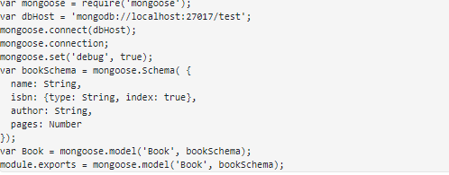
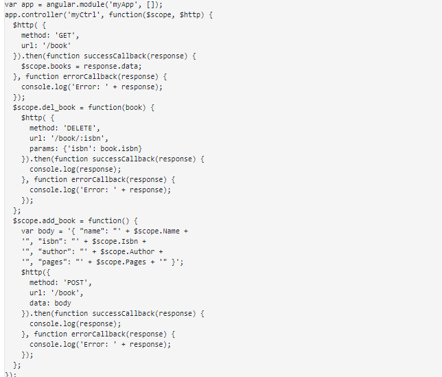
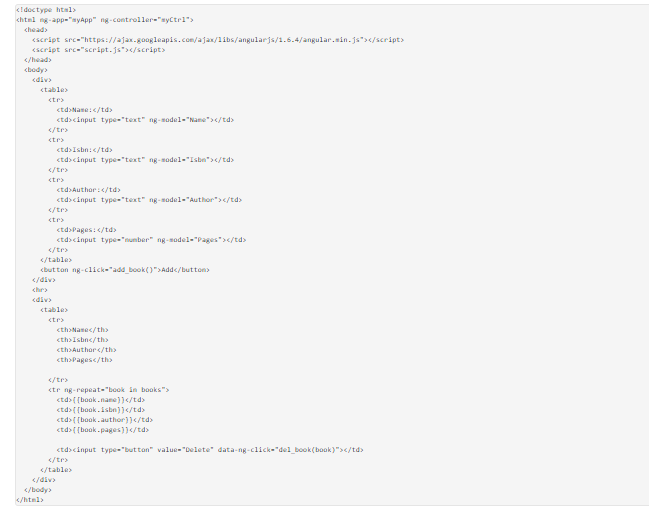
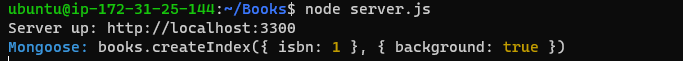

## DOCUMENTATION OF PROJECT 4

In this project we are going to implement a simple Book Register web form using MEAN stack

First we update ubuntu using `sudo apt update`, upgrade using the command `sudo apt upgrade`

Now we add certificates using the command 
`sudo apt -y install curl dirmngr apt-transport-https lsb-release ca-certificate
curl -sL https://deb.nodesource.com/setup_12.x | sudo -E bash -`

Install node.js using the command `sudo apt install -y nodejs` 

On to the next step we install mongodb, but first we run this command `sudo apt-key adv --keyserver hkp://keyserver.ubuntu.com:80 --recv 0C49F3730359A14518585931BC711F9BA15703C6
`  and  
`echo "deb [ arch=amd64 ] https://repo.mongodb.org/apt/ubuntu trusty/mongodb-org/3.4 multiverse" | sudo tee /etc/apt/sources.list.d/mongodb-org-3.4.list
`

Now we install mongodb using the command `sudo apt install -y mongodb` . Start the server using the command `sudo service mongodb start`. verify that the system is up and running using `sudo systemctl status mongodb`

Now we install NPM (node package manager) using the command `sudo apt install -y npm`

Now install the body parser package, body parser packages helps to process .json files , use command `sudo npm install body-parser`

Now we create a folder called books then changed directory there use the command `mkdir Books && cd Books` this will do both task at once

In the Books directory, Initialize npm project `npm init`. Add a file to the directory named server.js , now open the file using VI text editor `vi server.js` edit and exit the file

Now we install express and setup routes to the server 

first we install express and mongoose with the command `sudo npm install express mongoose`

Now we are going to create a folder named apps in books dir, change dir to apps folder and create a file named routes.js with the command `vi routes.js` insert the code and exit the editor

In the apps folder create a folder named models and change dir there.

In model dir create a file named book.js, insert the code below there 

Now we are going to Access the routes with Angularjs, AngularJS provides a web framework for creating dynamic views in your web applications.

 Change the directory back to books using the command `cd ../..`

 Create and change dir to a folder named public using the command `mkdir public && cd public`. Add a file named script.js use the command `vi script.js`. input the code below and save the file.

 

Now in public folder dir create a file named index.html. Copy and paste the code below into index.html file.

 

 Now change the directory back to books and start the server by running the command `node server.js`

  

Server is up and running. open port 3300 so we can view our application on the browser. 

## COMPLETED THE MEAN STACK APPLICATION 

